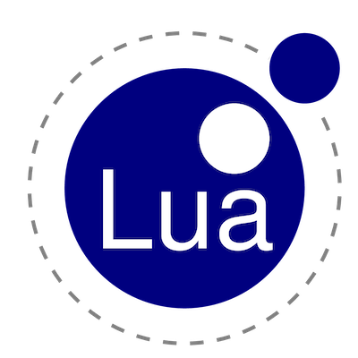

<!-- https://simpleicons.org/ -->
    

  
  
  
  
     

# For software engineering to knowledge engineering

> Ever thought of software engineering as knowledge engineer? Not bracket matching but the creation and stewardship of
what humans think is important (as well as methods for how to get it)?

Hello 

:vertical_traffic_light:  pause.  
:traffic_light: wait.     
:warning:	warning.      
:construction: building.  
:beginner:	 starting.      
:sunrise:  origin.     
:stars:	 tempting.      
:statue_of_liberty:   hopeful.     
:rainbow:  joyous.      
:rocket:	goging places.      
:airplane:	  taking off.    
:helicopter:   buzzing.     

Here is a simple footnote[^1]. With some additional text after it.

[^1]: My reference.

Here by "knowledge" I mean the thing defined by Allen Newell in the classic "Knowedge LEvel" talk (AAAI 1992). To Newell,
intelligence was a goal seeking process that (a) identified the goals we want then (b) reflected on
what operators were available in order for us to get there then (c) selected the appropriate operators then (d) adapted those operators
to the current task. Note that for Newell, how those operators were build was a lover level "symbol-level" issue. These operators could
be Python scripts, data mining function, logical axioms, etc. In terms of the knowledge level, the important thing is that we
should be able to reflect over them before deciding how to best use them.
   
In my view this is an engineering process (where engineering means "building a useful project to an acceptable standard
given the local constants"). Good knowledge engineers are lazy in that they try to do
the most, with  least effort, while consuming the fewest resources. Also, I would say that good engineers are stewards, not
owners, of their resources[^1] and, a good stewart, they try to leave behind the most resources (in the healthiest condition)
for those that will come after them.
  
To do that, good knowledge engineers know their tools, insider and out, since this lets them reconfigure their tools to
best suite the current task. 
  
|`y=f(x)`   | no `x` | few `x`| much `x` |
|-----------|--------|--------|----------|
| no y      | model (*)| re    |   mine    |
| expensive y|       |  explore (+)   |         |
| cheap y   |        |        | mine,otpimize |

(*) model
  
- feature models
- production rules (fuzzing)
- state machines
- bayes nets
- compartmental models
- CNF (or DNF)
  
(+) explore:
- SMO (general term)
- TPE (more specific)
 
 
|`y=f(x)`               |  no `x` oracle | cheap `x` oracle | expensive `x` oracle |
|-----------------------|----------------|------------------|----------------------|
| no `y` oracle         |  ?          |contrast & cluster & visualize|   ssl (=)            |
| cheap `y` oracle      |  ?          |mine,optimize     | ?  cluster&visuzlize   |  
| expensive  `y` oracle |  ?          |ssl(=),more(%)    |  ?                      |

 
 contrast
   
 - find what's different in two sets
 - seek the most informative differences 

 clustering
 - with lots of data, recursively cluster
 - with very little data, cluster top level

(%) re = multi-objective requirements engineering (aka interactive search-based se)
 
- show people examples, watch them debate them
- to avoid cognitive overload, only argue the fewest, most informative examples 
- do not expect consensus. Instead, collect the (possibly conflicting) goals that everyone has

(=) ssl = semi-supervised learning
  
- cluster the data
- collect a few (?one) label per cluster
- spread those labels within one cluster
- spread thsoe labels to other clusters

## Premable: names in this space
### Globals
**Trap globals** here, so to report rogue globals (at end: see `rogues()`).

## Topics
key

- (mining)
- ^optimization
- ?evaluation : evaluation concept
- ALGORITHMS : uppercase

topics

- mining
- optimziation
- theorem proving

= kb =

  * Taks
  * Guntebrg
  * 

Model

- logic
  - propositional
  - horn clause : PROLOG, ASP
  - etc
- compartmental models
- state charts
- misc (just a function)
- etc

Statistics

- Basics
  - Types
    - Nominal (discrete), mode,=,\=, entropy
    - Ordinal, Interval
    - Ratio (numeric), mean <.>, stdev
     - Central tendancies
  - mean, median mode: WELDORD
- Diversity measures
  - entropy: MML
  - standard deviation: WELFORD
 - less than
    - points "<"
    - distributions (Significance, Effect size, lessThan)
    - domination (multi-dimensional less than)
      - Pareto frontier
      - bdom
      - cdom : ZITLER
    - Significance
      - parametric: TTEST
      - bootstrap
    - Effect size: COHEN, HEDGES, CLIFFSDELTA
    - Procedures) : SCOTT.KNOTT
 
Mining

- discretize
  - supervised
    - CHI_MERGE
    - FAYYAD_IRANI
  - unsupervised
    - EWD
    - ZCHOP
    - EFD
- cluster: KMEANS
- contrast: TAR3, WHICH
- regression: RANDOM.FORESTS, CART
- classify: PKZIP, 
  - PKZIP 
- decision tree
  - decision tree classifiers CART
  - decision tree aggressors  CART
- random forest
 

FAT = fariness, accountatbility, transparency
- 
- Explain
  - LIME,TimeLIME, SHAP

Optimize

- log2(log(1-.95)/log(1-.05))

- when is 60 should be enoigh 

Theorem proving

- representation
- truth tables (implies, excludes)
- fuzzy logic
- abduction, deduction, induction
- examples (product lines)
- davis putnam
- clause model
- backdoors

Algorithms

- Welford's method (incremental standard deviation)
- bootstrap
- cart
- chiMerge
- cliffsDelta
- hedges
- kmeans
- LIME
- naiveBayes
- pkzip 
- prolog
- reservoir sampler
- sax https://www.cs.ucr.edu/~stelo/papers/SIGKDD_2004_long.pdf
- SHAP
- TimeLIME
- ttest
